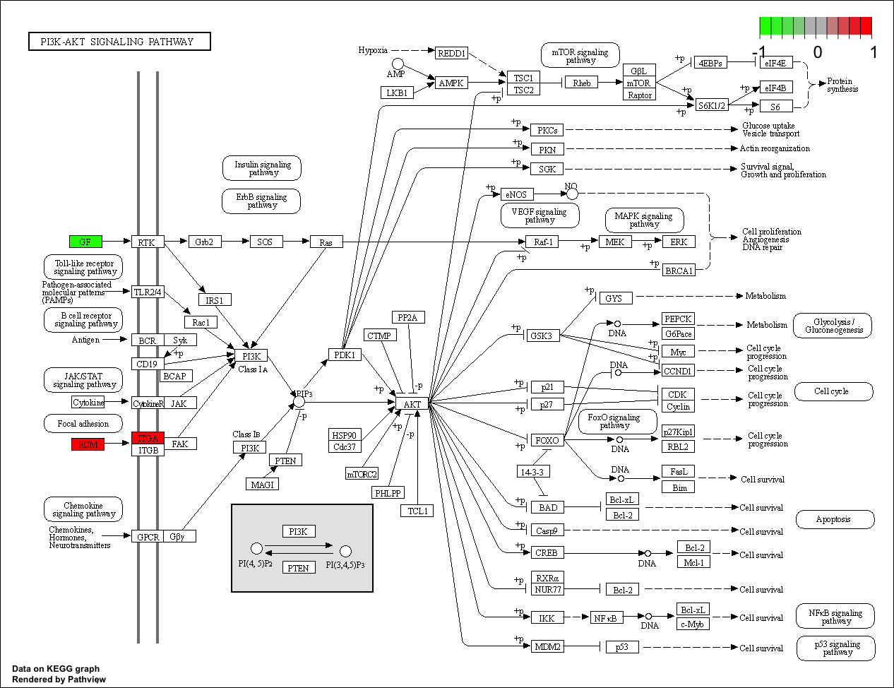

For GSE23400 dataset


```{r}
library(affy)
library(limma)
library(tibble)
library(ggplot2)
library(dplyr)
library(ggrepel)
library(ggrepel)
library(readr)
library(limma)
library(pheatmap)
```

```{r}
library(GEOquery)
## change my_id to be the dataset that you want.
my_id <- "GSE23400"
gse <- getGEO(my_id)
```

```{r}
length(gse)
```

```{r}
gse1 <- gse[[1]]
gse1
```


```{r}
gse2 <- gse[[2]]
gse2
```

```{r}
pData(gse1) ## print the sample information
fData(gse1) ## print the gene annotation
exprs(gse1) ## print the expression data
```

```{r}
pData(gse2) ## print the sample information
fData(gse2) ## print the gene annotation
exprs(gse2) ## print the expression data
```


```{r}
summary(exprs(gse1))
```


```{r}
boxplot(exprs(gse1),outline=FALSE)
```


```{r}
sampleInfo <- pData(gse1)
sampleInfo
```

```{r}
write_tsv(sampleInfo, file="/Users/anb/Documents/CMEB-Lab/ESCC-Drug-Repositioning/DR-escc-data/output/GSE23400/GSE23400_sampleinfo.tsv")
```


```{r}
sampleInfoCorrected=read_tsv(file = "/Users/anb/Documents/CMEB-Lab/ESCC-Drug-Repositioning/DR-escc-data/output/GSE23400/GSE23400_sampleinfoCorrected.tsv")
```


```{r}
sampleInfo
```


```{r}
sampleInfoCorrected
```


```{r fig.height=15, fig.width=15}
corMatrix <- cor(exprs(gse1),use="c")
pheatmap(corMatrix)
```


```{r}
rownames(sampleInfoCorrected)
```

```{r}
colnames(corMatrix)
```

```{r}
rownames(sampleInfoCorrected) <- colnames(corMatrix)
```

```{r}
as.numeric(corMatrix)
```


```{r}
pca <- prcomp(t(exprs(gse1)))

```

```{r}
## Join the PCs to the sample information
cbind(sampleInfoCorrected, pca$x) %>% 
ggplot(aes(x = PC1, y=PC2, col=group,label=paste("Patient", patient))) + geom_point() + geom_text_repel()
```

```{r}
full_output <- cbind(fData(gse1),exprs(gse1))
write_csv(full_output, path="/Users/anb/Documents/CMEB-Lab/ESCC-Drug-Repositioning/DR-escc-data/output/GSE23400/gse1_full_output.csv")
write_tsv(full_output, file = "/Users/anb/Documents/CMEB-Lab/ESCC-Drug-Repositioning/DR-escc-data/output/GSE23400/gse1_full_output.tsv")
```


```{r}
design <- model.matrix(~0+sampleInfoCorrected$group)
design
```


```{r}
colnames(design) <- c("Normal","Tumour")
```


```{r}
summary(exprs(gse1))

## calculate median expression level
cutoff <- median(exprs(gse1))

## TRUE or FALSE for whether each gene is "expressed" in each sample
is_expressed <- exprs(gse1) > cutoff

## Identify genes expressed in more than 2 samples

keep <- rowSums(is_expressed) > 2

## check how many genes are removed / retained.
table(keep)

## subset to just those expressed genes
gse1 <- gse1[keep,]
```


```{r}
fit <- lmFit(exprs(gse1), design)
head(fit$coefficients)
```


```{r}
contrasts <- makeContrasts(Tumour - Normal, levels=design)

## can define multiple contrasts
## e.g. makeContrasts(Group1 - Group2, Group2 - Group3,....levels=design)

fit2 <- contrasts.fit(fit, contrasts)
```


```{r}
fit2 <- eBayes(fit2)
```


```{r}
topTable(fit2)
```

```{r}
topTable(fit2, coef=1)
```
```{r}
decideTests(fit2)
```


```{r}
table(decideTests(fit2))
```


```{r}
anno <- fData(gse1)
anno
```

```{r}
anno <- dplyr::select(anno,'Gene Symbol', 'ENTREZ_GENE_ID', 'Gene Title', 'RefSeq Transcript ID')
fit2$genes <- anno
topTable(fit2)
```

```{r}
full_results <- topTable(fit2, number=Inf)
full_results <- tibble::rownames_to_column(full_results,"ID")
```

```{r}
ggplot(full_results,aes(x = logFC, y=B)) + geom_point()
```


```{r}
## change according to your needs
p_cutoff <- 0.01
fc_cutoff <- 1.5

full_results %>% 
  mutate(Significant = adj.P.Val < p_cutoff & abs(logFC) > fc_cutoff) %>% 
  ggplot(aes(x = logFC, y = B, col=Significant)) + geom_point() 
```

```{r, }
p_cutoff <- 0.05
fc_cutoff <- 1
topN <- 20
options(ggrepel.max.overlaps = Inf)

full_results %>% 
  mutate(Significant = adj.P.Val < p_cutoff &
           abs(logFC) > fc_cutoff ) %>% 
  mutate(Rank = 1:n(), Label = ifelse(Rank < topN, Gene.Symbol,"")) %>% 
  ggplot(aes(x = logFC, y = B, col=Significant,label=Label)) + geom_point() + geom_text_repel(col="black")
```

```{r}
filter(full_results, Gene.Symbol == "CXCL1")
```

```{r}
p_cutoff <- 0.05
fc_cutoff <- 1

filter(full_results, adj.P.Val < 0.05, abs(logFC) > 1)
```


```{r}
filter(full_results, adj.P.Val < 0.05, abs(logFC) > 1) %>%
  write_tsv(file = "/Users/anb/Documents/CMEB-Lab/ESCC-Drug-Repositioning/DR-escc-data/output/GSE23400/filtered_de_results_1fc_05pval.tsv")
```

```{r}
filter(full_results, adj.P.Val < 0.01, abs(logFC) > 1.5) %>%
  write_tsv(file = "/Users/anb/Documents/CMEB-Lab/ESCC-Drug-Repositioning/DR-escc-data/output/GSE23400/filtered_de_results_1-5fc_01pval.tsv")
```


```{r}
p_cutoff <- 0.01
fc_cutoff <- 1.5

genes_output = filter(full_results, adj.P.Val < 0.01, abs(logFC) > 1.5)
```

```{r}
as.data.frame(genes_output$Gene.Symbol) %>%
  write_tsv(file = "/Users/anb/Documents/CMEB-Lab/ESCC-Drug-Repositioning/DR-escc-data/output/GSE23400/filtered_de_results_1-5fc_01pval-genes.tsv")
```


```{r}
full_results %>%
  write_tsv(file = "/Users/anb/Documents/CMEB-Lab/ESCC-Drug-Repositioning/DR-escc-data/output/GSE23400/unfiltered_de_results.tsv")
```


```{r}
# reading in data from deseq2

df = read.csv("/Users/anb/Documents/CMEB-Lab/ESCC-Drug-Repositioning/DR-escc-data/output/GSE23400/filtered_de_results.csv", header=TRUE)
```

```{r}
sort(df)
```

```{r}

```


```{r}
topN <- 20
##
ids_of_interest <- mutate(full_results, Rank = 1:n()) %>% 
  filter(Rank < topN) %>% 
  pull(ID)
```

```{r}
gene_names <- mutate(full_results, Rank = 1:n()) %>% 
  filter(Rank < topN) %>% 
  pull(Gene.Symbol) 
```

```{r}
gene_matrix <- exprs(gse1)[ids_of_interest,]
```


```{r fig.height=5, fig.width=15}
pheatmap(gene_matrix,
     labels_row = gene_names)
```
```{r}
library(org.Hs.eg.db)
```

##### GENE SET ENRICHMENT ANALYSIS ######


```{r}
library(affy)
library(limma)
library(tibble)
library(ggplot2)
library(dplyr)
library(ggrepel)
library(ggrepel)
library(readr)
library(limma)
library(pheatmap)
```


```{r}
library(pathview)
library(clusterProfiler)
library(enrichplot)
library(enrichplot)
library(ggplot2)
library(europepmc)
library(dplyr)
library(ggnewscale)
```


```{r}
organism = "org.Hs.eg.db"
BiocManager::install(organism, character.only = TRUE)
library(organism, character.only = TRUE)
```


```{r}
# reading in data from deseq2

df = read.csv("/Users/anb/Documents/CMEB-Lab/ESCC-Drug-Repositioning/DR-escc-data/output/GSE23400/DEG-analysis/filtered_de_results_1fc_05pval_dupsdropped.tsv", sep="\t", header=TRUE)
```


```{r}
df
```

```{r}
upreg <- df[df$logFC >= 1, ]
downreg <- df[df$logFC <= -1, ]
```


```{r}
upreg_gene_list <- upreg$Gene.Symbol
downreg_gene_list <- downreg$Gene.Symbol
```

```{r}
write_tsv(as.data.frame(upreg_gene_list), file="/Users/anb/Desktop/upreg_gene_list_1fc_05pval.tsv", col_names = FALSE)
write_tsv(as.data.frame(downreg_gene_list), file="/Users/anb/Desktop/downreg_gene_list_1fc_05pval.tsv", col_names = FALSE)
```


```{r}
# we want the log2 fold change 
original_gene_list <- df$logFC

# name the vector
names(original_gene_list) <- df$Gene.Symbol

# omit any NA values 
gene_list<-na.omit(original_gene_list)

# sort the list in decreasing order (required for clusterProfiler)
gene_list = sort(gene_list, decreasing = TRUE)
```

```{r}
df
```


```{r}
filtdf <- df %>% distinct(Gene.Symbol, .keep_all = TRUE)
```


```{r}
df <- filtdf
```

```{r}
df
```


```{r}
gse <- gseGO(geneList=gene_list, 
             ont ="ALL", 
             keyType = "SYMBOL", 
             minGSSize = 3, 
             maxGSSize = 800, 
             pvalueCutoff = 0.05, 
             verbose = TRUE, 
             OrgDb = organism, 
             pAdjustMethod = "none")
```


```{r, dotplot, echo=FALSE,fig.height=4, dev='jpeg'}
require(DOSE)
dotplot(gse, showCategory=10, split=".sign") + facet_grid(.~.sign)
```


```{r}
genesets <- gse[]
```

```{r}
genesets
```


```{r}
library(readr)
write_tsv(genesets, file="/Users/anb/Desktop/genesets_1-5fc_01pval.txt")
```


```{r}
 test <- strsplit(genesets$core_enrichment, "/")
```

```{r}
class(test)
```


```{r}
testlabelled <- setNames(test, genesets$Description)
```

```{r}
lengths(testlabelled)
```


```{r}
class(testlabelled)
```

```{r}
as.data.frame(testlabelled[1])
```


```{r}
library(purrr)
nodesdf <- map_df(testlabelled, ~as.data.frame(.x), .id="id")
```


```{r}
newheaders <- c("MODULE", "NODE")
colnames(nodesdf) <- newheaders
```


```{r}
nodesdf
```


```{r}
nodesdf$MODULE <- gsub(" ", "_", nodesdf$MODULE)
```


```{r}
nodesdf
```


```{r}
library(readr)
write_tsv(nodesdf, file="/Users/anb/Desktop/nodesdf_1-5fc_01pval.txt")
```


```{r}
genesets <- gse[]
```

```{r}
genesets[1,12]
```


```{r}
library(readr)
write_csv(genesets, file="/Users/anb/Desktop/genesets_1-5fc_01pval.txt")
```


```{r fig.height=5}
x2 <- pairwise_termsim(gse)
```

```{r fig.height=5}
emapplot(x2, layout = "nicely")
```


```{r fig.height=6, fig.width=8}
cnetplot(gse, layout = "nicely", categorySize = "pvalue", node_label = "all", foldChange=gene_list, showCategory = 5)
```


```{r}
library("ggridges")
```

```{r, fig.height=8, fig.width=8}
ridgeplot(gse) + labs(x = "enrichment distribution")
```


```{r}
gseaplot(gse, by = "all", title = gse$Description[1], geneSetID = 1)
```


```{r}
gseaplot(gse, by = "all", title = gse$Description[2], geneSetID = 2)
```

```{r}
gseaplot(gse, by = "all", title = gse$Description[3], geneSetID = 3)
```

```{r}
gseaplot(gse, by = "all", title = gse$Description[4], geneSetID = 4)
```

```{r}

```


```{r}
terms <- gse$Description[1:3]
pmcplot(terms, 2010:2021, proportion=FALSE)
```


### KEGG Analysis ###


```{r}
# we want the log2 fold change 
kegg_gene_list <- df$logFC

# name the vector
names(kegg_gene_list) <- df$ENTREZ_GENE_ID

# omit any NA values 
kegg_gene_list<-na.omit(kegg_gene_list)

# sort the list in decreasing order (required for clusterProfiler)
kegg_gene_list = sort(kegg_gene_list, decreasing = TRUE)
```


```{r}
kegg_organism = "hsa"
kk2 <- gseKEGG(geneList     = kegg_gene_list,
               organism     = kegg_organism,
               minGSSize    = 20,
               maxGSSize    = 800,
               pvalueCutoff = 0.05,
               keyType       = "ncbi-geneid")
```


kegg_organism = "hsa"
kk2 <- gseKEGG(geneList     = kegg_gene_list,
               organism     = kegg_organism,
               nPerm        = 10000,
               minGSSize    = 3,
               maxGSSize    = 800,
               pvalueCutoff = 0.05,
               pAdjustMethod = "fdr",
               keyType       = "ncbi-geneid")


```{r,  fig.height = 4, fig.width = 6}
dotplot(kk2, showCategory = 10, title = "Enriched Pathways" , split=".sign") + facet_grid(.~.sign)
```


```{r}
kk2
```


```{r, fig.height = 6, fig.width = 8}
kk2_2 <- pairwise_termsim(kk2)
 emapplot(kk2_2)
```

```{r, fig.height = 6, fig.width = 8}
cnetplot(kk2, categorySize="pvalue", foldChange=gene_list)
```

```{r}
kk2[]
```

```{r, fig.height=8, fig.width=20}
ridgeplot(kk2) + labs(x = "enrichment distribution")
```

```{r}
gseaplot(kk2, by = "all", title = kk2$Description[1], geneSetID = 1)
```

```{r}
gseaplot(kk2, by = "all", title = kk2$Description[2], geneSetID = 2)
```


```{r}
library(pathview)
```

```{r}
kk2[]
```


```{r}
hsa <- pathview(gene.data=kegg_gene_list, pathway.id="hsa04151", species = kegg_organism)
```

```{r}

```
